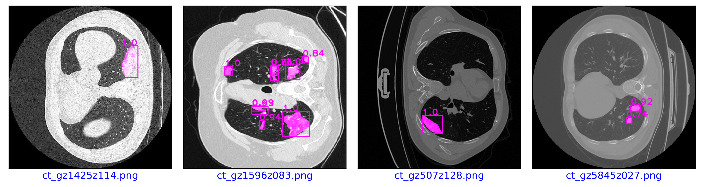
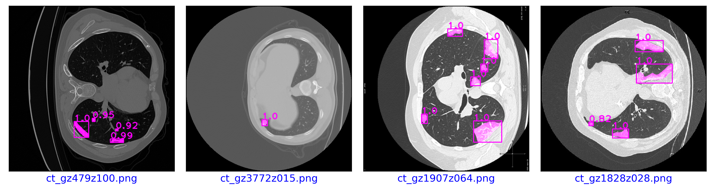
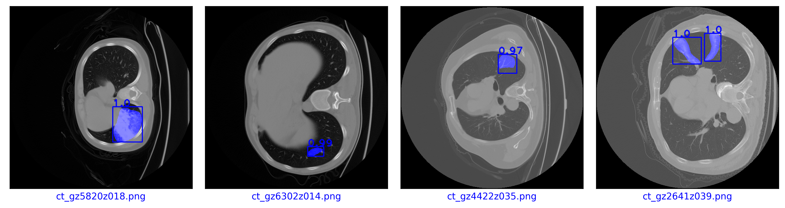
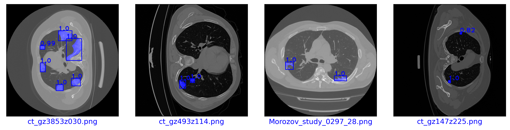
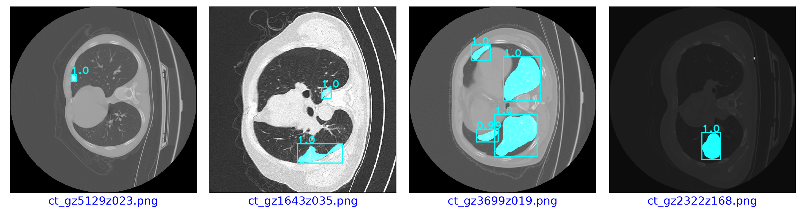
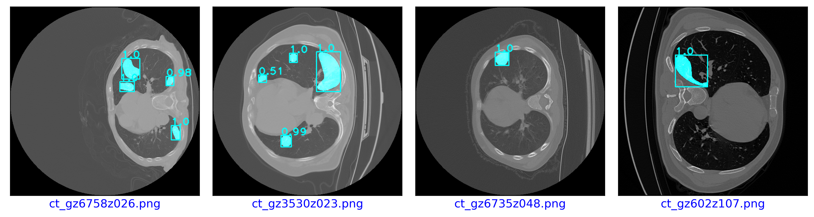
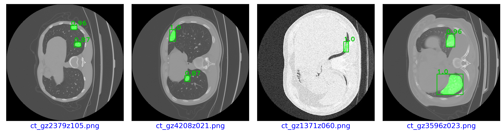

<h1><div style="text-align: center;">  COVID-19 Detection and Segmentation in chest CT image slices</div></h1>


## 1. Introduction

Medical classification has widely benefited from recent developments in computer vision, especially deep artificial neural networks. This work is the continuation of the COVID-19 classification study, which has already been published in the [Journal of Imaging](https://www.mdpi.com/2313-433X/8/9/237#cite&#41). Here we evaluated the performance of the Mask-RCNN deep learning neural network to segment lesions of COVID-19 on chest CT 2D images. The kernel of the first covolution layer of backbone of the Mask-RCNN-ResNet-50-FPN was resized[1] for the segmentation of COVID-19 in infected lungs, together with the creation of custom anchors for detection. We additionally built Mask-RCNN-MobileNet-v3-large-FPN. The fine-tuned Mask-RCNN-ResNet-50 -FPN was the base to compare whether the proposed models surpassed the base model performance for segmentation and detection of COVID-19 in infected CT 2D images. 


## 2. Experimental Design

The experimental setup consisted of the combination of the Mask-RCNN architecture with modification to the ResNet-50-FPN backbone. The modifications wrere made to the backbone:

- Resize kernels from the first convolutional layer of the feature extractor - the original 
  dimensions were size 7 x 7. The kernels were resized to 3 x 3 and 5 x 5. 
- Customed anchors - standard sizes = (32, 64, 128, 256, 512) and aspect ratios = (0.5, 1.0, 2.0)
  The custom sizes were anchor sizes= (8, 16, 32, 64, 128, 256) and aspect ratios=(0.25, 0.5, 1.0, 1.5, 2.0). 

In addition, we built Mask-RCNN-MobileNet-large-v3-FPN with the following features:
- anchor sizes = (8, 16, 32, 64, 128, 256) and aspect_ratios = (0.25, 0.5, 1.0, 2.0)

Mask-RCNN-ResNet-50-FPN-v2  was used as the base model. This version has a ResNet-50-FPN backbone from the benchmarking detection with vision transformers [2]. Table 1 shows the experimental design for this work.


<div align="center">

__Table 1__ Experimental design for the segmentationand detection of COVID-19 in CT 2D images.
Mask-Mobile-CA \
was built with the same sizes and aspect ration than the custom anchors for the models with ResNet-50-FPN.

| Exp |     Model      |                Net                | Resized </br>Kernel | Sizes | Customed</br>Anchors |
|-----|:--------------:|:---------------------------------:|:-------------------:|:-----:|:--------------------:|
| 1   |   Base model   |      Mask-RCNN-ResNet-50-FPN      |          -          |   -   |          -           |
| 2   |    Mask-CA     |      Mask-RCNN-ResNet-50-FPN      |          -          |   -   |         True         |
| 3   |    Mask-RK3    |      Mask-RCNN-ResNet-50-FPN      |        True         | 3 x 3 |          -           |
| 4   |  Mask-RK3-CA   |      Mask-RCNN-ResNet-50-FPN      |        True         | 3 x 3 |         True         |
| 5   |    Mask-RK5    |      Mask-RCNN-ResNet-50-FPN      |        True         | 5 x 5 |          -           |
| 6   |  Mask-RK5-CA   |      Mask-RCNN-ResNet-50-FPN      |        True         | 5 x 5 |         True         |
| 7   | Mask-Mobile-CA| Mask-RCNN-MobileNet-v3-large-FPN  |          -          |   -   |          -           |

</div>

## 3. Datasets
The COVID-19 data was ingested from the sources below:

1. COVID-19 Lung CT Lesion Segmentation Challenge - 2020, 199 patients https://covid-segmentation.
grand-challenge.org/COVID-19-20/

2. COVID-19 CT Lung and Infection Segmentation Dataset, 20 patients (only infection mask used) 
https://zenodo.org/record/3757476#.YTdEx55Kg1h

3. Medseg AI - SIRM, 100 images from over 48 patients - https://medicalsegmentation.com/covid19/

4. MosMedData Dataset COVID19_1110, 50 patients https://mosmed.ai/datasets/covid19_1110/

Except for the MosMedData, all datasets were compressed NIfTI volumes (nii.gz). All images were put together in one dataset. 


## 4. Methods

### 4.1 Data Processing

The 3D volumes were sliced on plane z (axial) and converted to 2D images. All sliced images were put 
together in one dataset. The total size of the datase was 7396 2D images from more than 317 patients from multi-nations.

The sliced dataset was randomly split using the three-way holdout method with ratios of 80:10:10 with 5917, 739 an 740 2D images for training, validation, and testing, respectively. Random horizontal flips and scale jitter were applied on the fly to the training subset.


**Associated code**

- ``` utility\convert_nii2png.py```
- ```utility\nii_vis_dataset.ipyn ``` 


### 4.2 Training and Validation

The models were trained and validated for 50 epochs. The loss, mean average precision for detection and segmentation (mAP) were recorded during the training and validation process. The training parameters are depicted in Table 2.

__Table 2__ Experimental parameters.

| Parameter             |   Value           |
|----------------------|-------------------|
| Learning <br/>rate   |  1.5 e-5, 2.0 e-5 |
| Batch <br/>size      |  4                | 
| Epochs               |  50               | 
| Optimizer	           |  AdamW            |
| Scheduler            |  Reduce on plateau| 

**Associated code**
- ```covid_dataset.py```
- ```detection``` folder
- ```detection``` folder
- `````` utility\plotting.py``````
- ```maskrcnn_main.ipynb```


### 4.3 Evaluation

The models were evaluated with the COCO style metric mean average precision (mAP). The mAP at intersections over unions (IoU) of 0.50, 0.75 and the range (0.5, 0.95, 05) were computed at each training epoch on the validation subset. The trained models were further evaluated on the test subset and the results were ranked.


## 5. Results

Table 3 shows the best mAP achieved per each model on the test subset. Exp-05 and Exp-07 achieved their best mAP when trained with a learning rate of 2.0 e-5, while the other models were trained with a learning rate of 1.5 e-5. Mask-RK3 showed the highest mAP for segmentation and the second largest mAP for detection (Tables 3-4). Meanwhile, Mask-CA achieved the highest detection mAP of all models.


__Table 3.__ Best experimental results after training for 50 epochs, using AdamW optimizer and learning scheduler on the on-plateau.


| Exp |   Model        |  mAPb       | APb @ <br/>IoU=0.50 | APb @ <br/>IoU=0.75 | mAPseg    | mAPseg <br/>@ IoU=0.50 | mAPseg <br/>@ IoU=0.75 | 
|-----|:--------------:|:-----------:|:-------------------:|:-------------------:|:---------:|:----------------------:|:----------------------:|
| 1   |  Base model    |0.4231       | 0.7278              | 0.4336              | 0.3639    | 0.7227                 | 0.3338                 |
| 2   |  Mask-CA       |__0.7067__   |  0.866              | __0.7847__          | 0.5575    | 0.8635                 | 0.6301                 |
| 3   |  Mask-RK3      | 0.6612      | __0.8942__          | 0.7509              | __0.5695__| __0.8818__             | __0.6446__             |
| 4	  |  Mask-RK3-CA   |0.6648       | 0.8398              | 0.741               |  0.5519   |   0.8358               |   0.6381               |
| 5   |  Mask-RK5      |0.6347       |  0.877              |  0.718              |  0.5486   |   0.8712               | 0.6096                 | 
| 6   |  Mask-RK5-CA   |0.5989       | 0.7976              | 0.6561              | 0.4966    | 0.7971                 | 0.5598                 |
| 7   | Mask-Mobile-CA |0.5081       | 0.7511              | 0.5382              | 0.3876    | 0.7138                 | 0.3932                 |


__Table 4.__ Models ranking per metric.

| Exp |   Model        |  mAPb       | APb @ <br/>IoU=0.50 | APb @ <br/>IoU=0.75 | mAPseg    | mAPseg <br/>@ IoU=0.50 | mAPseg <br/>@ IoU=0.75 | 
|-----|:--------------:|:-----------:|:-------------------:|:-------------------:|:---------:|:----------------------:|:----------------------:|
| 1   |  Base model    |7.0          | 7.0                 | 7.0                 |7.0        |   6.0                  |7.0                     |
| 2   |  Mask-CA       |__1.0__      | 3.0                 | __1.0__             |2.0        |   3.0                  | 3.0                    |
| 3   |  Mask-RK3      |3.0          | __1.0__             | 3.0                 | __1.0__   | __1.0__                | __1.0__                |
| 4	  |  Mask-RK3-CA   |2.0          | 4.0                 | 2.0                 |  3.0      |   4.0                  |  2.0                   |
| 5   |  Mask-RK5      |4.0          | 2.0                 | 4.0                 |  4.0      |   2.0                  | 4.0                    | 
| 6   |  Mask-RK5-CA   |5.0          | 5.0                 | 5.0                 | 5.0       |   5.0                  | 5.0                    |
| 7   | Mask-Mobile-CA |6.0          | 6.0                 | 6.0                 | 6.0       |   7.0                  | 6.0                    |


Tables 3-4 showed that Mask-RK3 model which has a ResNet-50-FPN backbone and kernels of size 3 x 3 outperformed the other models at segmenting COVID-19 lessions in CT sliced images. Mask-CA showed the highest performance for the detection of COVID-19. Work conducted by [3] reported mAP at Iou=0.5 of 0.623 for the detection of COVID-19 in X-rays with YOLO-v5 network. A LSTM network with attention mechanism has achieved an mAP 0.4469 at IoU range[0.5:0.05:0.95] for segmentation of COVID-19 lession in the lungs [4]. The models in this work achieved mAP at IoU=0.5 starting from 0.7138 and mAP at IoU range [0.5:0.05:0.95] from 0.3639 to 0.5695 for the segmentation of COVID-19. In addition, all models achieved mAP at IoU=0.50 over 0.72 for the detections of COVID-19.


The weights for the best two wodels Exp-02 and Exp-03 can be accesss on 
[best weights](https://drive.google.com/file/d/1m9cDDWT1KIwV6s7uVXSA4wME41PZnRpj/view?usp=sharing).


### 5.1 Inference example



__Fig 1.__ Exp-01: Base model inference on four images from the test subset.



__Fig 2.__ Exp-02: Mask-CA model inference on four images from the test subset.



__Fig 3.__ Exp-03: Mask-RK3 model inference on four images from the test subset.



__Fig 4.__ Exp-04: Mask-RK3-CA model inference on four images from the test subset.



__Fig 5.__ Exp-05: Mask-RK5 model inference on four images from the test subset.



__Fig 6.__ Exp-06: Mask-RK5-CA model inference on four images from the test subset.



__Fig 7.__ Exp-07: Mask-Mobile-CA model inference on four images from the test subset.


## References

[1] A. Ascencio-Cabral and C. C. Reyes-Aldasoro, “Comparison of Convolutional Neural Networks and Transformers for the Classification of Images of COVID-19, Pneumonia and Healthy Individuals as Observed with Computed Tomography,” Journal of Imaging, vol. 8, no. 9, p. 237, Sep. 2022, doi: 10.3390/jimaging8090237.

[2] Y. Li, S. Xie, X. Chen, P. Dollar, K. He, and R. Girshick, ‘Benchmarking Detection Transfer Learning with Vision Transformers’. arXiv, Nov. 22, 2021. doi: 10.48550/arXiv.2111.11429.

[3] R. Qu, Y. Yang and Y. Wang, "COVID-19 Detection Using CT Image Based On YOLOv5 Network," 2021 3rd International Academic Exchange Conference on Science and Technology Innovation (IAECST), 2021, pp. 622-625, doi: 10.1109/IAECST54258.2021.9695714.

[4] A. Ter-Sarkisov, "One Shot Model for COVID-19 Classification and Lesions Segmentation in Chest CT Scans Using Long Short-Term Memory Network With Attention Mechanism," in IEEE Intelligent Systems, vol. 37, no. 3, pp. 54-64, 1 May-June 2022, doi: 10.1109/MIS.2021.3135474.


### Installation
- Set up a Python 3.8 environment or higher
- Install Pycocotools `` pip install cython`` and
```pip install -U 'git+https://github.com/cocodataset/cocoapi.git#subdirectory=PythonAPI```

